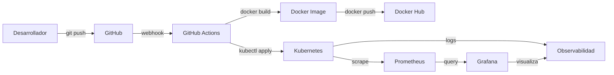

# Arquitectura del Laboratorio DevOps

Este documento describe en detalle la arquitectura del laboratorio DevOps para la aplicación "Consulta Médica".

## Visión General

El laboratorio implementa un flujo de trabajo DevOps completo que abarca desde el desarrollo local hasta el despliegue en producción (simulado en Kubernetes local). La arquitectura se divide en varias capas:

1. **Capa de Control de Versiones:** GitHub
2. **Capa de CI/CD:** GitHub Actions
3. **Capa de Orquestación:** Kubernetes (Docker Desktop)
4. **Capa de Aplicación:** PHP + Apache
5. **Capa de Datos:** MySQL
6. **Capa de Observabilidad:** Prometheus + Grafana

## Componentes Principales

### 1. Aplicación "Consulta Médica"

La aplicación es un sistema de gestión de consultas médicas desarrollado en PHP con arquitectura MVC. Características principales:

- **Framework:** MVC personalizado (sin dependencias externas)
- **Lenguaje:** PHP 8.0
- **Base de Datos:** MySQL 5.7
- **Servidor Web:** Apache 2.4
- **Autenticación:** Sesiones seguras con bcrypt
- **Validación:** Sanitización y validación de datos en servidor

#### Estructura de la Aplicación

```
app/
├── config/          # Configuración de la aplicación
│   ├── app.php
│   ├── database.php
│   └── routes.php
├── core/            # Clases base del framework
│   ├── Controller.php
│   ├── Database.php
│   ├── Model.php
│   ├── Router.php
│   ├── Security.php
│   ├── Session.php
│   ├── Validator.php
│   └── bootstrap.php
├── controllers/     # Controladores de la aplicación
├── models/          # Modelos de datos
├── views/           # Vistas (templates)
├── public/          # Archivos públicos (CSS, JS, imágenes)
└── sql/             # Scripts de base de datos
```

### 2. Contenerización con Docker

El Dockerfile empaqueta la aplicación PHP con Apache en una imagen Docker reproducible.

#### Dockerfile

```dockerfile
FROM php:8.0-apache

# Instalar extensiones necesarias
RUN docker-php-ext-install pdo pdo_mysql mbstring

# Copiar código de la aplicación
COPY ./app /var/www/html/

# Habilitar mod_rewrite
RUN a2enmod rewrite

# Establecer permisos
RUN chown -R www-data:www-data /var/www/html/

EXPOSE 80
```

**Ventajas:**
- Reproducibilidad: La misma imagen se ejecuta en desarrollo y producción.
- Portabilidad: La imagen funciona en cualquier entorno con Docker.
- Aislamiento: La aplicación está aislada del sistema host.

### 3. Orquestación con Kubernetes

Kubernetes gestiona el ciclo de vida de los contenedores, proporcionando:

- **Auto-scaling:** Ajusta automáticamente el número de réplicas.
- **Auto-healing:** Reinicia los pods que fallan.
- **Load Balancing:** Distribuye el tráfico entre los pods.
- **Rolling Updates:** Actualiza la aplicación sin downtime.

#### Componentes de Kubernetes

**Namespace:** `consulta-medica`

Todos los recursos se despliegan en un namespace dedicado para aislamiento.

**Deployments:**

| Nombre | Replicas | Imagen | Propósito |
| :--- | :--- | :--- | :--- |
| `consulta-medica` | 2 | `consulta-medica:latest` | Aplicación principal |
| `mysql` | 1 | `mysql:5.7` | Base de datos |
| `prometheus` | 1 | `prom/prometheus:latest` | Recolección de métricas |
| `grafana` | 1 | `grafana/grafana:latest` | Visualización de métricas |

**Services:**

| Nombre | Tipo | Puerto | Propósito |
| :--- | :--- | :--- | :--- |
| `consulta-medica` | LoadBalancer | 80 | Acceso a la aplicación |
| `mysql` | ClusterIP | 3306 | Acceso interno a la BD |
| `prometheus` | LoadBalancer | 9090 | Acceso a Prometheus |
| `grafana` | LoadBalancer | 3000 | Acceso a Grafana |

**ConfigMaps y Secrets:**

- `app-config`: Variables de entorno de la aplicación.
- `db-secret`: Credenciales de la base de datos (codificadas en Base64).
- `prometheus-config`: Configuración de Prometheus.
- `grafana-datasource`: Configuración de fuentes de datos en Grafana.

### 4. Infraestructura como Código (IaC)

Terraform define toda la infraestructura de Kubernetes de manera declarativa.

#### Beneficios de Terraform

- **Versionado:** La infraestructura se versionea como código.
- **Reproducibilidad:** Se puede reproducir el mismo entorno múltiples veces.
- **Documentación:** El código sirve como documentación viva.
- **Automatización:** Los cambios se aplican automáticamente.

#### Recursos de Terraform

```hcl
# Namespace
resource "kubernetes_namespace" "consulta_medica"

# ConfigMaps y Secrets
resource "kubernetes_config_map" "app_config"
resource "kubernetes_secret" "db_secret"

# Deployments
resource "kubernetes_deployment" "mysql"
resource "kubernetes_deployment" "app"
resource "kubernetes_deployment" "prometheus"
resource "kubernetes_deployment" "grafana"

# Services
resource "kubernetes_service" "mysql"
resource "kubernetes_service" "app"
resource "kubernetes_service" "prometheus"
resource "kubernetes_service" "grafana"

# PersistentVolumeClaims
resource "kubernetes_persistent_volume_claim" "mysql_pvc"
```

### 5. Gestión de la Configuración con Ansible

Ansible automatiza el despliegue y la configuración de los recursos en Kubernetes.

#### Playbook Principal

El playbook realiza las siguientes acciones:

1. Verifica que kubectl está disponible.
2. Crea el namespace `consulta-medica`.
3. Despliega MySQL y espera a que esté listo.
4. Despliega la aplicación.
5. Despliega Prometheus y Grafana.
6. Verifica el estado de todos los pods.

#### Ventajas de Ansible

- **Agentless:** No requiere software adicional en los nodos.
- **Idempotente:** Se puede ejecutar múltiples veces sin efectos secundarios.
- **Legible:** La sintaxis YAML es fácil de entender.

### 6. CI/CD con GitHub Actions

El pipeline de GitHub Actions automatiza el proceso de build, test, y deploy.

#### Fases del Pipeline

**Fase 1: Build**
- Checkout del código
- Construcción de la imagen Docker
- Push a Docker Hub

**Fase 2: Test**
- Linting de PHP
- Pruebas básicas de salud

**Fase 3: Security Scan**
- Escaneo de vulnerabilidades con Trivy

**Fase 4: Deploy**
- Actualización de la imagen en Kubernetes
- Espera del rollout

**Fase 5: Observabilidad**
- Recolección de métricas
- Verificación de endpoints

**Fase 6: Métricas DORA**
- Cálculo de Lead Time
- Cálculo de Deployment Frequency
- Cálculo de Change Failure Rate
- Estimación de MTTR

**Fase 7: Notificación**
- Resumen del pipeline

#### Triggers del Pipeline

El pipeline se activa en los siguientes eventos:

- Push a las ramas `main` o `develop`
- Pull requests a las ramas `main` o `develop`

### 7. Observabilidad

#### Prometheus

Prometheus recolecta métricas del clúster de Kubernetes y la aplicación.

**Configuración:**

```yaml
global:
  scrape_interval: 15s
  evaluation_interval: 15s

scrape_configs:
  - job_name: 'kubernetes-apiservers'
  - job_name: 'kubernetes-nodes'
  - job_name: 'kubernetes-pods'
```

**Métricas Recolectadas:**

- CPU y memoria de los pods
- Estado de los pods (up/down)
- Número de restarts
- Latencia de las solicitudes HTTP

#### Grafana

Grafana visualiza las métricas recolectadas por Prometheus.

**Dashboards Predefinidos:**

- Cluster Overview
- Node Exporter
- Pod Resource Usage
- Application Metrics

**Configuración de Datasources:**

Grafana se configura automáticamente con Prometheus como fuente de datos.

### 8. Pruebas de Resiliencia

El script `observability/resilience-test.sh` realiza pruebas para validar la capacidad de auto-reparación de Kubernetes.

#### Pruebas Realizadas

1. **Fallo de Pod:** Elimina un pod y verifica que Kubernetes crea uno nuevo.
2. **Escalado:** Aumenta y disminuye el número de replicas.
3. **Reinicio:** Reinicia el deployment para simular una actualización.
4. **Análisis de Logs:** Muestra logs y eventos relevantes.
5. **Métricas de Prometheus:** Verifica que Prometheus está recolectando métricas.
6. **Dashboards de Grafana:** Verifica que Grafana está visualizando datos.

#### Métricas de Resiliencia

- **MTTR (Mean Time to Recovery):** Tiempo promedio para recuperarse de un fallo.
- **Availability:** Porcentaje de tiempo que la aplicación está disponible.
- **Recovery Rate:** Velocidad de recuperación después de un fallo.

### 9. Métricas DORA

El pipeline calcula las siguientes métricas DORA:

#### 1. Lead Time for Changes

**Definición:** Tiempo desde que se realiza un commit hasta que se despliega en producción.

**Cálculo:** `Timestamp de despliegue - Timestamp del commit`

**Valor Esperado:** < 1 hora (en laboratorio)

#### 2. Deployment Frequency

**Definición:** Número de despliegues en un período de tiempo.

**Cálculo:** Número de commits en los últimos 7 días.

**Valor Esperado:** > 1 por semana (en laboratorio)

#### 3. Change Failure Rate

**Definición:** Porcentaje de despliegues que resultan en un incidente.

**Cálculo:** `(Despliegues fallidos / Total de despliegues) * 100`

**Valor Esperado:** < 15% (en laboratorio)

#### 4. Mean Time to Recovery (MTTR)

**Definición:** Tiempo promedio para recuperarse de un incidente.

**Cálculo:** Tiempo desde la detección del fallo hasta la resolución.

**Valor Esperado:** < 1 hora (en laboratorio)

## Flujo de Datos



## Consideraciones de Seguridad

1. **Autenticación:** Las credenciales se almacenan en Secrets de Kubernetes.
2. **Autorización:** Se utilizan RBAC (Role-Based Access Control) para controlar el acceso.
3. **Encriptación:** Las credenciales en GitHub Actions se almacenan como secretos.
4. **Validación:** La aplicación valida todas las entradas de usuario.
5. **Scanning:** El pipeline escanea las imágenes en busca de vulnerabilidades.

## Escalabilidad

La arquitectura es escalable en las siguientes dimensiones:

1. **Réplicas de la Aplicación:** Aumentar el número de replicas en el deployment.
2. **Recursos de Kubernetes:** Aumentar la capacidad del clúster.
3. **Base de Datos:** Implementar replicación o sharding.
4. **Observabilidad:** Agregar más métricas y dashboards.

## Limitaciones del Laboratorio

1. **Entorno Local:** El laboratorio se ejecuta en un entorno local, no en la nube.
2. **Datos Persistentes:** Los datos se pierden cuando se reinicia el clúster.
3. **Métricas DORA Simuladas:** Las métricas se calculan en un entorno controlado.
4. **Sin HA:** No hay alta disponibilidad para los componentes críticos.
5. **Sin Backup:** No hay mecanismos de backup automático.

## Próximas Mejoras

1. **Persistent Volumes:** Implementar almacenamiento persistente para MySQL.
2. **Ingress:** Configurar un Ingress Controller para enrutamiento avanzado.
3. **Network Policies:** Implementar políticas de red para seguridad.
4. **RBAC:** Configurar roles y permisos granulares.
5. **Helm Charts:** Empaquetar los manifests en Helm Charts.
6. **ArgoCD:** Implementar GitOps con ArgoCD.
7. **Monitoring Avanzado:** Agregar alertas y notificaciones.
