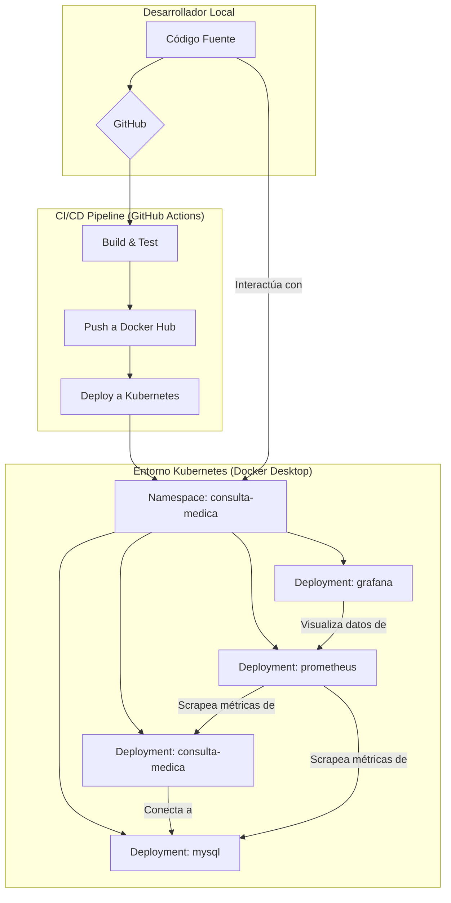

> **Versión 2.0 - Actualización a Jenkins Local**
> Esta versión del laboratorio ha sido actualizada para utilizar **Jenkins** como motor de CI/CD y un **registro Docker local**, eliminando la dependencia de servicios externos como GitHub Actions y Docker Hub.

# Laboratorio DevOps End-to-End Local con Jenkins

Este repositorio contiene una solución completa y reproducible para implementar un ciclo de vida DevOps de extremo a extremo en un entorno local. Utiliza la aplicación "Consulta Médica" (una aplicación PHP/MySQL con arquitectura MVC) como caso de estudio para demostrar conceptos clave de DevOps, incluyendo Infraestructura como Código (IaC), Integración y Entrega Continuas (CI/CD), orquestación con Kubernetes, y observabilidad.

## 🎯 Objetivo del Laboratorio

El objetivo principal de este laboratorio es proporcionar una demostración práctica y documentada de un flujo de trabajo DevOps completo, utilizando herramientas estándar de la industria en un entorno local controlado. Al finalizar este laboratorio, se habrá implementado:

- **Infraestructura como Código (IaC):** Utilizando Terraform para definir y gestionar la infraestructura de Kubernetes de manera declarativa.
- **Gestión de la Configuración:** Empleando Ansible para automatizar la configuración de la aplicación y el despliegue de recursos en el clúster.
- ****CI/CD Local:** Utilizando **Jenkins** corriendo en Kubernetes para orquestar el pipeline.
- **Orquestación de Contenedores:** Desplegando la aplicación y sus dependencias en un clúster de Kubernetes local (gestionado por Docker Desktop).
- **Observabilidad:** Implementando un stack de monitoreo con Prometheus para la recolección de métricas y Grafana para la visualización de dashboards.
- **Resiliencia y Auto-reparación:** Demostrando la capacidad de Kubernetes para recuperarse automáticamente de fallos.
- **Métricas DORA:** Calculando métricas clave de rendimiento de DevOps en un entorno de laboratorio.

## 🧱 Arquitectura de la Solución

La solución se ejecuta completamente en un entorno local, simulando un despliegue en la nube. La arquitectura general es la siguiente:



## 💻 Pila Tecnológica

| Categoría | Herramienta | Propósito |
| :--- | :--- | :--- |
| Orquestación | **Kubernetes (en Docker Desktop)** | Entorno de ejecución para los contenedores. |
| Contenerización | **Docker** | Empaquetar la aplicación y sus dependencias. |
| IaC | **Terraform** | Definir la infraestructura de Kubernetes. |
| Configuración | **Ansible** | Automatizar el despliegue y configuración. |
| **CI/CD** | **Jenkins** | Orquestación del pipeline de integración y entrega continua. | |
| Monitoreo | **Prometheus** | Recolección de métricas del clúster y la app. |
| Visualización | **Grafana** | Creación de dashboards de observabilidad. |
| Aplicación | **PHP 8.0 + Apache** | Backend de la aplicación "Consulta Médica". |
| Base de Datos | **MySQL 5.7** | Almacenamiento de datos de la aplicación. |

## 🚀 Guía de Implementación

### Requisitos Previos

Antes de comenzar, asegúrate de tener instalado lo siguiente en tu máquina local:

- **Docker Desktop:** Con Kubernetes habilitado.
- **Git:** Para clonar el repositorio.
- **Terraform:** Para la gestión de la infraestructura.
- **Ansible:** Para la automatización de la configuración.
- **kubectl:** Para interactuar con el clúster de Kubernetes.
- **Helm:** (Opcional) Para gestionar paquetes de Kubernetes.
- **Una cuenta de GitHub:** Para utilizar GitHub Actions.
- **Una cuenta de Docker Hub:** Para almacenar la imagen de la aplicación.

### Estructura del Repositorio

El repositorio está organizado de la siguiente manera:

```
consulta_medica-devops/
├── Jenkinsfile             # Pipeline de Jenkins
├── ansible/                # Playbooks de Ansible
├── app/                    # Código fuente de la aplicación
├── docker/                 # Dockerfile para la app
├── jenkins/                # Scripts de configuración de Jenkins
│   ├── deploy-jenkins.sh
│   └── setup-jenkins.sh
├── k8s/                    # Manifiestos de Kubernetes
│   ├── jenkins-deployment.yaml
│   └── docker-registry-deployment.yaml
├── observability/          # Configuración de monitoreo
├── terraform/              # Código de Terraform (IaC)
└── README.md               # Esta guía
```

### Pasos de Despliegue

1.  **Configurar Docker para el Registro Local Inseguro:**

    -   Abre Docker Desktop > Settings > Docker Engine.
    -   Añade la siguiente línea al JSON de configuración y reinicia Docker:
        ```json
        "insecure-registries": ["localhost:5000"]
        ```

2.  **Desplegar la Infraestructura Base (App, DB, Monitoreo):**

    ```bash
    # Navega al directorio de Terraform
    cd terraform

    # Inicializa y aplica la configuración
    terraform init
    terraform apply --auto-approve
    ```

3.  **Desplegar Jenkins y el Registro Docker Local:**

    ```bash
    # Ejecuta el script de despliegue de Jenkins
    cd ../jenkins
    chmod +x deploy-jenkins.sh
    ./deploy-jenkins.sh
    ```

4.  **Configurar Jenkins:**

    -   Accede a Jenkins en `http://localhost:8080` (admin/admin).
    -   Crea un nuevo Job de tipo "Pipeline".
    -   En la configuración del pipeline, selecciona "Pipeline script from SCM".
    -   Configura el SCM para usar tu repositorio Git local.
    -   Asegúrate de que el "Script Path" sea `Jenkinsfile`.

5.  **Ejecutar el Pipeline:**

    -   Inicia el build del pipeline que acabas de crear. Jenkins clonará el repositorio, construirá la imagen, la subirá al registro local y la desplegará en Kubernetes.

3.  **Verificar el Despliegue:**

    Una vez que el pipeline haya finalizado, puedes verificar el estado del despliegue con `kubectl`:

    ```bash
    kubectl get all -n consulta-medica
    ```

    Deberías ver los pods, deployments, y services para `consulta-medica`, `mysql`, `prometheus`, y `grafana`.

4.  **Acceder a los Servicios:**

    -   **Aplicación Consulta Médica:** `http://localhost`
    -   **Prometheus:** `http://localhost:9090`
    -   **Grafana:** `http://localhost:3000` (usuario: `admin`, contraseña: `admin`)

### Pruebas de Resiliencia

Para demostrar la capacidad de auto-reparación de Kubernetes, puedes ejecutar el script de pruebas de resiliencia:

```bash
chmod +x observability/resilience-test.sh
./observability/resilience-test.sh
```

Este script realizará las siguientes acciones:

-   Eliminará un pod de la aplicación para observar cómo Kubernetes crea uno nuevo automáticamente.
-   Escalará el número de réplicas del deployment.
-   Reiniciará el deployment para simular una actualización.
-   Mostrará logs y eventos relevantes para el análisis.

### Métricas DORA

El `Jenkinsfile` ha sido configurado para calcular y mostrar las métricas DORA en la salida de la consola de cada build, manteniendo la visibilidad sobre el rendimiento del proceso de entrega.

## 📄 Conclusión

Esta versión 2.0 del laboratorio demuestra con éxito cómo migrar de un sistema de CI/CD basado en la nube (GitHub Actions) a una solución 100% local y auto-hospedada con Jenkins, sin perder las capacidades clave de DevOps. Esto proporciona un entorno de aprendizaje y experimentación aún más controlado y seguro.
